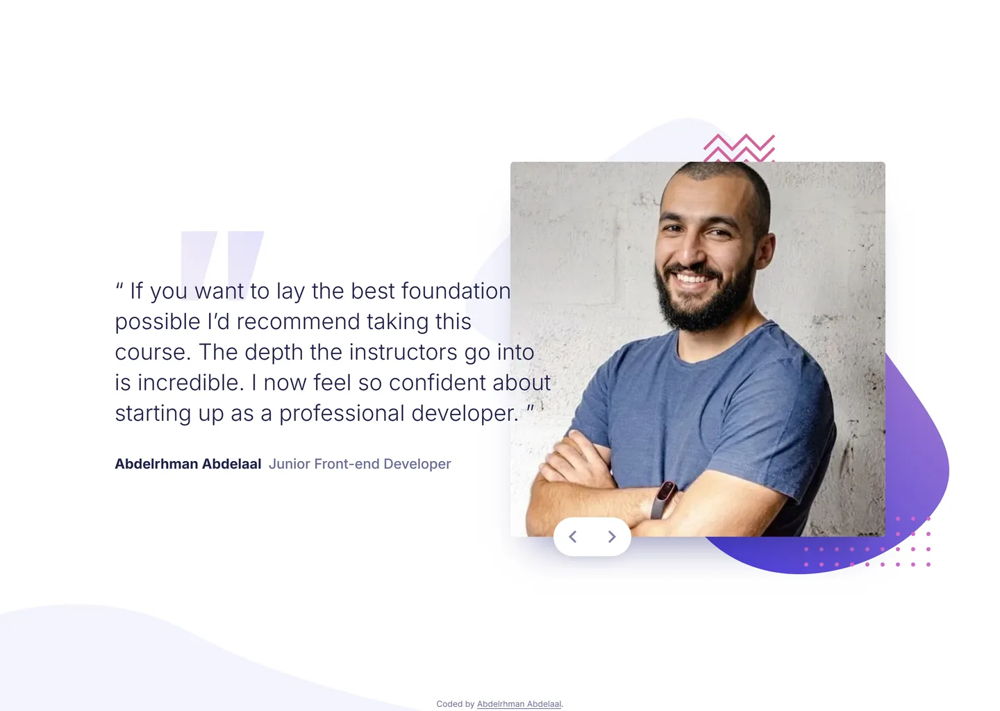

# Frontend Mentor - Coding bootcamp testimonials slider solution

This is a solution to the [Coding bootcamp testimonials slider challenge on Frontend Mentor](https://www.frontendmentor.io/challenges/coding-bootcamp-testimonials-slider-4FNyLA8JL). Frontend Mentor challenges help you improve your coding skills by building realistic projects.

## Table of contents

- [Overview](#overview)
  - [Screenshot](#screenshot)
  - [Links](#links)
- [My process](#my-process)
  - [Built with](#built-with)
  - [Design deviations](#design-deviations)
- [Author](#author)

## Overview

### Screenshot

### Links

- Solution URL: [GitHub](https://github.com/MrBlackvanta/coding-bootcamp-testimonials-slider)
- Live Site URL: [Cloudflare](https://coding-bootcamp-testimonials-slider.abdelrhman-ahmed8881.workers.dev)

## My process

### Built with

- [Next.js 16](https://nextjs.org/) (App Router, React Compiler, Turbopack)
- [React 19](https://react.dev/)
- [TypeScript](https://www.typescriptlang.org/) (strict)
- [Tailwind CSS v4](https://tailwindcss.com/)

### Design deviations

Everything below is deliberate, with the reason. Every other measured value matches the Figma
source exactly.

| What                   | Design                   | Built     | Why                                                                                                                                                                                                                                                                                                 |
| ---------------------- | ------------------------ | --------- | --------------------------------------------------------------------------------------------------------------------------------------------------------------------------------------------------------------------------------------------------------------------------------------------------- |
| Role text colour       | `#b9b9ce`                | `#6c6c98` | 1.93:1 on white fails WCAG AA. The replacement keeps the hue and saturation, and clears 4.5:1 on both white and the pale curve the attribution sits on at mobile widths.                                                                                                                            |
| Quote panel width      | 635px                    | 632px     | The design's own line 2 on slide 2 measures 634.771px, so Chrome fits a word Figma's integer glyph advances wrapped. 632px sits mid-way through the 6.5px window that reproduces both slides' line breaks — and since the panel has no visible edge, its width is only observable through the wrap. |
| Vertical centring      | card top at y=113        | y=121     | The composition is centred in the viewport rather than pinned to the design frame's offset, so it holds at any height. Uniform +8px at 1440×800; nothing else moves.                                                                                                                                |
| Quote panel top offset | 165px below the card top | 164px     | Tailwind's rem-based spacing scale.                                                                                                                                                                                                                                                                 |
| Quote mark left offset | 95px                     | 96px      | Same.                                                                                                                                                                                                                                                                                               |
| Curve height           | 150.9px                  | 154px     | Frontend Mentor's own `pattern-curve.svg` is 154 tall where the Figma node reports 150.9. Kept the shipped artwork; its width, left edge and top all match.                                                                                                                                         |

## Author

- UpWork - [Abdelrhman Abdelaal](https://www.upwork.com/freelancers/mrblackvanta)
- Frontend Mentor - [@MrBlackvanta](https://www.frontendmentor.io/profile/MrBlackvanta)
- LinkedIn - [Abdelrhman Abdelaal](https://www.linkedin.com/in/abdelrhman-vanta/)
